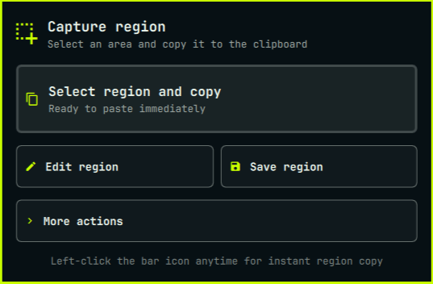
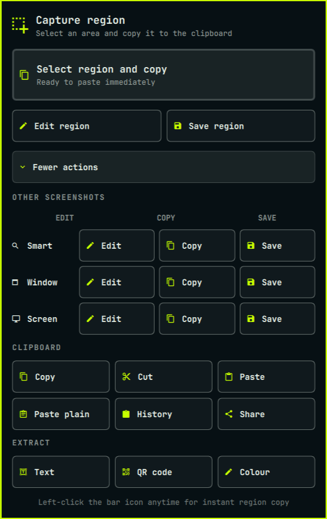

# Capture Board

Capture Board is a region-first screenshot and clipboard widget for the
Omarchy Quattro bar. Its primary action takes one click: select an area of the
screen and the image is copied, ready to paste.



<details>
<summary>See every secondary action</summary>



</details>

## Features

- One-click region selection directly from the bar
- Region capture to clipboard, editor, or file
- Smart, window, and fullscreen screenshots
- Terminal-aware copy, cut, and paste shortcuts
- Plain-text paste, clipboard history, and LocalSend sharing
- OCR text capture, QR decoding, and colour picking
- **Convert**: automatic unit, timestamp, and currency conversion for
  whatever is on the clipboard when you open the panel
- Keyboard-accessible panel controls

## Convert

Capture a value and Capture Board automatically offers useful conversions —
there's no separate app, no new shortcut, and nothing to launch. Opening the
panel (right-click the bar icon, or `omarchy-shell io.github.3eye3y3.capture-board open`)
looks at whatever is currently on the clipboard, and if it recognizes a
convertible value, shows a compact **CONVERT** card above the usual capture
actions with the suggested conversion and a **COPY RESULT** action. Ordinary
text — a sentence, a URL, a plain number — produces no card at all.

```
72°F
CONVERT
22.2°C                              [ COPY RESULT ]
```

### Supported categories

- Temperature (°C / °F / K)
- Length, including compound feet+inches ( `5'11"`, `6 ft 2 in` )
- Area (m², sq ft, acres, hectares, …)
- Volume, with US and UK units kept distinct
- Mass/weight (mg/g/kg, oz/lb/stone)
- Speed (km/h, mph, knots, m/s)
- Pressure (Pa/kPa/hPa/bar, psi, inHg)
- Energy and power, kept as separate dimensions (J/kJ/Wh/kWh vs. W/kW)
- Data size, distinguishing SI (KB/MB/GB/TB) from IEC (KiB/MiB/GiB/TiB)
- Duration (seconds/minutes/hours/days)
- Unix timestamps (seconds or milliseconds) and ISO-8601, to local time
- Time-zone expressions such as `3:30 PM UTC`, to local time
- Fuel economy (L/100km, km/L, mpg US, mpg UK — shown side by side)
- Colours: HEX, RGB, and HSL, with a swatch
- Angles (degrees/radians)
- A few explicitly-supported compound expressions: `6 ft x 4 ft` (dimensions
  and area), `4.7 GB @ 25 MB/s` (transfer time), `350°F for 25 minutes`
  (temperature + duration) — Convert does not attempt general arithmetic
  beyond these
- Currency, using live (or cached) exchange rates

Recognition is entirely local pattern-matching against the whole captured
value — regexes and unit tables, not an AI model — so it's effectively free
to run each time the panel opens, and an ordinary sentence never gets
mistaken for a unit.

### Ambiguous values

Some captures are genuinely ambiguous. `12 oz` could be a mass (340 g) or a
US fluid volume (355 mL) — Convert shows both rather than guessing. A bare
`$100` could be USD, CAD, AUD, or NZD — it never silently assumes USD.
Overloaded time-zone abbreviations (`IST`, for instance) are listed as
possibilities rather than resolved to one.

### Preferences

Convert preferences live inside the same panel, under **More actions →
Convert preferences** — there's no separate settings app. At minimum:

- Measurement system (metric / imperial)
- Preferred temperature unit
- Preferred currency
- Preferred fuel-economy unit
- Time format (12h / 24h)
- Data-size family (SI, IEC, or both)

Defaults come from your system locale (e.g. a US locale defaults to
imperial units and 12h time) and can be overridden per field. If a captured
value is already in your preferred system, Convert shows a different useful
representation instead of converting a value to itself (e.g. `180 cm`, for a
metric-preferring user, shows `5 ft 10.9 in`). Local time (for timestamps
and time-zone conversions) always uses your system's own timezone.

### Currency

Currency is the only category that touches the network, and only when you
actually capture a currency amount — never on ordinary captures. Rates are
fetched from a free, no-key exchange-rate API, cached locally, and reused
for 24 hours before being refreshed. If the network is unavailable, Convert
uses the cached rate and says so (`Cached rate · 8h old`); if there's no
cached rate at all, it says the rate is unavailable rather than guessing.
Only the currency lookup itself is sent over the network — never your
captured clipboard text.

### Privacy

- All recognition and conversion (every category except currency) happens
  entirely on-device; nothing is sent anywhere.
- Currency conversion sends only the exchange-rate request itself (no
  amount, no captured text) to the rate provider.
- Convert has no history or database of its own — it re-analyzes whatever
  is on the clipboard each time the panel opens, and keeps nothing beyond
  your preferences and the cached exchange-rate table.
- No AI, no analytics, no telemetry, no account.

## Install

```sh
omarchy plugin add https://github.com/3EYE3Y3/omarchy-capture-board.git --enable
```

The widget is placed in the left bar section by default.

## Use

| Action | Result |
| --- | --- |
| Left-click the capture icon | Select a region and copy it immediately |
| Right-click the capture icon | Open the compact Capture Board panel |
| Select region and copy | Start the same primary region-copy flow |
| Edit region | Select, annotate, save, and copy a region |
| Save region | Select a region and save it without opening the editor |
| More actions | Reveal other screenshot, clipboard, and extraction tools |

The panel can also be opened from a terminal:

```sh
omarchy-shell io.github.3eye3y3.capture-board open
```

Start region copy directly through shell IPC:

```sh
omarchy-shell io.github.3eye3y3.capture-board capture
```

Press `Escape` to close the panel. Controls can be reached with `Tab` and
activated with `Enter` or `Space`.

## Move the widget

```sh
omarchy bar move io.github.3eye3y3.capture-board --section left
```

Replace `left` with `center` or `right` to use another section.

## Dependencies and permissions

Capture Board targets Omarchy Quattro and uses commands included with a normal
Omarchy installation: `omarchy`, `omarchy-shell`, `hyprctl`, `wl-paste`,
`wl-copy`, `hyprpicker`, and `curl`.

- The **Share** action uses LocalSend through `omarchy share clipboard`.
- Screenshot and extraction actions use Omarchy's existing capture commands.
- Plain-text paste accepts advertised UTF-8 text up to 256 KiB. Clipboard data
  is passed through protected file descriptors and stdin, never command-line
  arguments; oversized, non-text, and invalid UTF-8 payloads are rejected.
- The plain-text paste path calls `/usr/bin/wl-paste` and `/usr/bin/wtype`
  directly and resolves its bundled helper beside the action script, avoiding
  executable substitution through `PATH`.
- Convert reads up to 8 KiB of the clipboard's advertised plain-text content
  (via `wl-paste`) each time the panel opens, and writes a converted result
  to the clipboard (via `wl-copy`) only when you choose Copy Result — both
  over stdin/stdout, never command-line arguments.
- Convert's currency lookup calls `curl` against a no-key exchange-rate API
  and caches the response under `~/.local/state/omarchy/capture-board/`;
  every other Convert category runs fully offline. See
  [Convert → Currency](#currency) and [Convert → Privacy](#privacy) above.
- Convert preferences are stored at
  `~/.local/state/omarchy/settings/capture-board.json`.
- The plugin installs no packages, services, hooks, or privileged policies.
- It requests no elevated permissions and does not overwrite user configuration.
- Network access occurs when the user explicitly chooses **Share**, or when
  Convert recognizes a currency amount and needs a rate it doesn't already
  have cached.

## Remove

```sh
omarchy plugin remove io.github.3eye3y3.capture-board
```

## License

[MIT](LICENSE)
